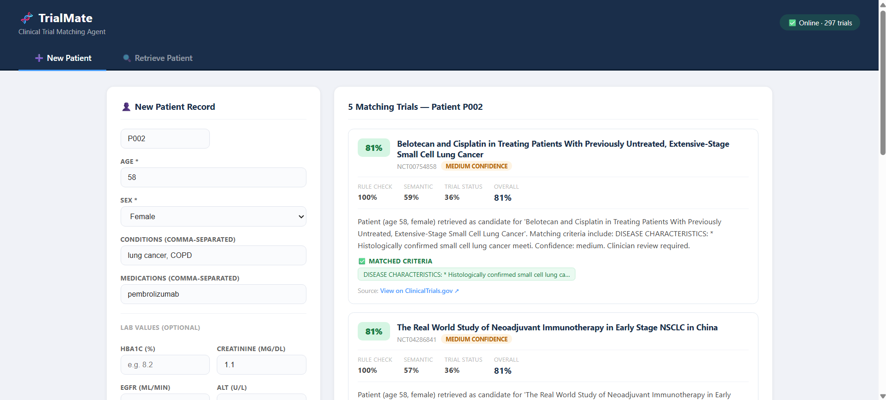
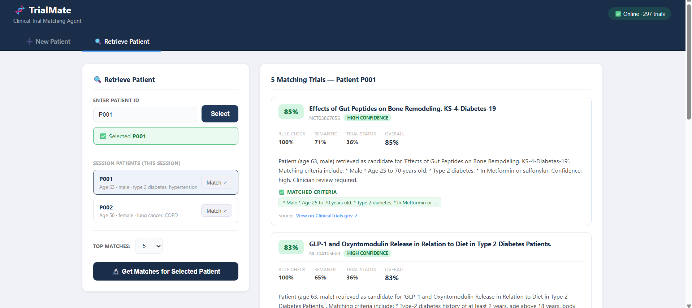

# 🧬 TrialMate — Clinical Trial Matching Agent

An AI-powered system that matches patient records to relevant clinical trials using semantic retrieval, deterministic rule verification, and LLM-generated explanations.

---

## What It Does

Given a patient's age, sex, diagnoses, medications, and lab values, TrialMate retrieves and ranks matching clinical trials from ClinicalTrials.gov — explaining exactly why each trial is or isn't a fit.




---

## Tech Stack

| Layer | Technologies |
|-------|-------------|
| **Backend API** | Python 3.11, FastAPI, Pydantic |
| **Vector Search** | FAISS, SentenceTransformers (`all-MiniLM-L6-v2`) |
| **LLM Integration** | Anthropic Claude API, OpenAI GPT (switchable) |
| **Rule Engine** | Custom regex-based NLP normalizer |
| **Frontend** | Vanilla JS, HTML/CSS (no framework) |
| **Infrastructure** | Docker, GitHub Actions CI |
| **Testing** | pytest, async integration tests |

---

## Key Features

- **Hybrid matching pipeline** — combines deterministic rule checks (age, sex, lab thresholds) with semantic vector search for a nuanced, explainable match score
- **LLM-generated rationales** — each match includes a plain-language explanation citing specific eligibility clause IDs, with a confidence level (high / medium / low)
- **Live data ingestion** — pulls real trials directly from the ClinicalTrials.gov public API, parses eligibility free-text into structured, searchable clauses
- **Configurable scoring** — weighted formula with tuneable hyperparameters: `score = 0.6 × rule + 0.3 × semantic + 0.1 × trial_status`
- **Provider-agnostic LLM layer** — swap between Anthropic, OpenAI, or a local Ollama model via a single environment variable
- **Response caching** — disk-based LLM response cache to minimise API costs during development
- **Auto-index management** — FAISS index automatically rebuilds when trial data is updated

---

## Architecture

```
Patient Record
      │
      ▼
 Embed patient summary ──► FAISS Vector Search ──► Top-K Clauses
                                                         │
                                          ┌──────────────┤
                                          ▼              ▼
                                    Rule Verifier   Semantic Score
                                    (age/sex/labs)  (cosine sim)
                                          │              │
                                          └──────┬───────┘
                                                 ▼
                                          Hybrid Score
                                                 │
                                                 ▼
                                      LLM Explanation Generator
                                                 │
                                                 ▼
                                        Ranked API Response
```

---

## API Endpoints

| Method | Endpoint | Description |
|--------|----------|-------------|
| `POST` | `/patients` | Upload patient record |
| `GET` | `/patients/{id}/matches` | Ranked trial matches with explanations |
| `GET` | `/trials/{nct_id}` | Trial metadata and parsed clauses |
| `GET` | `/health` | Server status and trial count |

---

## Sample Output

```json
{
  "patient_id": "P001",
  "matches": [
    {
      "nct_id": "NCT01234567",
      "title": "Study of Example Drug in Type 2 Diabetes",
      "score": 0.87,
      "confidence": "high",
      "matched_clauses": [
        { "text": "Ages 18 to 75 years" },
        { "text": "HbA1c between 7.0% and 10.0%" }
      ],
      "violated_clauses": [],
      "rationale": "Patient (age 63, T2DM, HbA1c 8.2%) meets all primary inclusion criteria. No exclusions identified."
    }
  ]
}
```

---

## Project Structure

```
trialmate/
├── api/               # FastAPI app, Pydantic schemas
├── matching/          # FAISS embedder, rule verifier, hybrid scorer
├── ingestion/         # ClinicalTrials.gov parser, clause splitter
├── llm/               # LLM client, prompt templates, explainer
├── tests/             # pytest unit + integration tests
├── ui/                # Web interface
└── scripts/           # Data generation and ingestion utilities
```

---

## Running Locally

```bash
pip install -r requirements.txt
python ingestion/trial_ingestor.py --input data/samples/sample_trials.json --output data/processed/trials.json
python -m uvicorn api.main:app --reload
# Open ui/index.html in browser
```